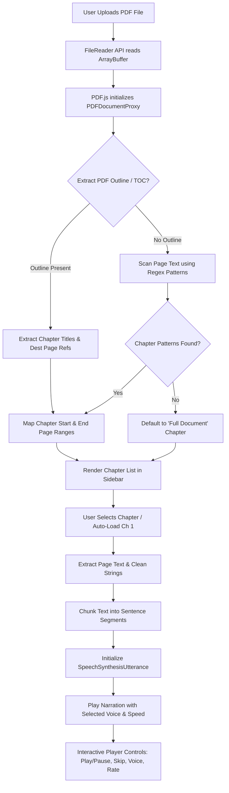

# PDF Narrator 📖🎧

A modern, responsive, client-side web application that transforms PDF documents into interactive narrated audiobooks using **PDF.js** and the **Web Speech API**.

---

## 🌟 Key Features

- 📄 **100% Client-Side PDF Processing**: Load and read PDFs directly in the browser without uploading documents to external servers.
- 📑 **Smart Chapter Detection**:
  - Automatically parses PDF Table of Contents / Outline metadata (`doc.getOutline()`).
  - Scans document text using pattern matching (`Chapter X`, `Ch. X`, `Chap. X`) when TOC is unavailable.
  - Gracefully falls back to full-document mode if no chapter headings are detected.
- 🔊 **Text-to-Speech (TTS) Narration Engine**:
  - Intelligent sentence-level text chunking for smooth, continuous narration.
  - Support for native browser voices with dropdown selector.
  - Dynamic playback rate control (0.75x to 2.0x).
- 🎨 **Modern Dark Glassmorphism UI**:
  - Styled with Tailwind CSS and Inter typography.
  - Interactive sidebar chapter navigator with full mobile drawer support.
  - Crisp iconography powered by Lucide Icons.

---

## 🔄 Detailed Application Workflow

The diagram below illustrates the end-to-end workflow from PDF upload to audio narration:



---

## 🛠️ Technology Stack

| Technology | Purpose |
| :--- | :--- |
| **HTML5 & Vanilla JavaScript** | Core structure and application state logic |
| **Tailwind CSS** | Responsive styling, dark mode theme & glassmorphism |
| **PDF.js (v3.11.174)** | Client-side PDF parsing and text content extraction |
| **Web Speech API** | Browser-native Text-to-Speech (`SpeechSynthesis`) |
| **Lucide Icons** | Vector icons for header, sidebar, and media player controls |
| **GitHub Actions** | Automated CI/CD deployment to GitHub Pages (`static.yml`) |

---

## 🚀 Quick Start & Local Development

Because **PDF Narrator** is built as a zero-build static web app, no compilation or bundler is required.

### 1. Clone the Repository
```bash
git clone https://github.com/gkhs13reet/pdfNarratorWeb.git
cd pdfNarratorWeb
```

### 2. Launch Local Server
You can host the directory using any HTTP static server:

- **Using Python 3**:
  ```bash
  python -m http.server 8000
  ```
- **Using Node / npx**:
  ```bash
  npx serve .
  ```
- **Using VS Code**: Right-click `index.html` and select **Open with Live Server**.

### 3. Open in Browser
Visit [`http://localhost:8000`](http://localhost:8000) in your web browser.

---

## 📁 Repository Structure

```
pdfNarratorWeb/
├── .github/
│   └── workflows/
│       └── static.yml    # GitHub Actions workflow for GitHub Pages deployment
├── index.html            # Single-page app containing UI, layout & JavaScript logic
└── README.md             # Project documentation and workflow guide
```

---

## 📜 License

Distributed under the MIT License. Feel free to fork, modify, and contribute!